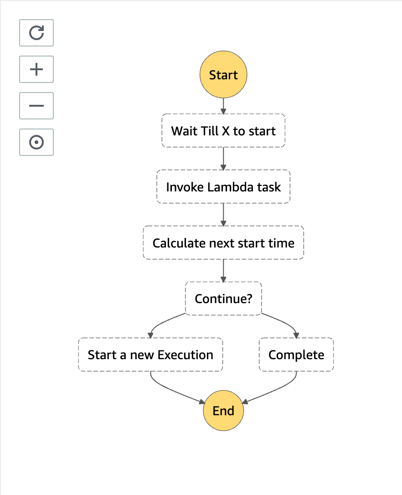

# Serverless Step Function Scheduler
This project is meant to serve as a bare bones template for scheduling tasks via AWS Step Functions. It is not a fully fleshed out solution and does not contain many of the added benefits of using step functions (ie. retry/error handling, parallel executions, multiple integration support, etc).

It utilizes the [Serverless framework](https://www.serverless.com/) to provision infrastructure and handle deployments. For detailed instructions on Serverless, please refer to the official [documentation](https://www.serverless.com/framework/docs/providers/aws/).

**CAUTION**: This is an advanced use case implementation for scheduling jobs in AWS. Other implementations might be preferable depending on your use case (ie. CloudWatch Events, AWS Batch, ECS Scheduled Tasks, DynamoDB TTL, Pinpoint).

For an in depth explanation of this implementation, as well as the pros and cons associated with it, please read through [Scheduling Jobs in AWS with Step Functions](https://medium.com/@curtishughes017/scheduling-jobs-in-aws-with-step-functions-41bc80cabe8f).

Example use cases:
- Need to define a start and/or end date for your scheduled job (ex. I want this job to run every hour starting Jan 1 at 1:00AM and end Jan 2 at 1:00AM).
- Need retry or error logic (ex. If this task fails, try to execute it 4 more times and on the 6th error cancel the job and send a push notification).
- Need synchronous executions (ex. I don't want to start the next execution until the prev one finishes).
- Parallel Executions (ex. kick off 6 tasks and wait for all of them to pass before continuing).
- Visualization capabilities (ex. history of past executions, visualizations of each step and execution, list upcoming executions).
- Need various AWS service integration support (ex. Lambda, SNS, SQS, CodeBuild, [etc](https://docs.aws.amazon.com/step-functions/latest/dg/connect-supported-services.html))

## Installation/deployment instructions

Depending on your preferred package manager, follow the instructions below to deploy your project.

> **Requirements**: NodeJS `lts/fermium (v.14.15.0)`. If you're using [nvm](https://github.com/nvm-sh/nvm), run `nvm use` to ensure you're using the same Node version in local and in your lambda's runtime.

### Using NPM

- Run `npm i` to install the project dependencies
- Run `npx sls deploy` to deploy this stack to AWS

### Using Yarn

- Run `yarn` to install the project dependencies
- Run `yarn sls deploy` to deploy this stack to AWS

### Locally

In order to test the `calculator` function locally, run the following command:

- `npx sls invoke local -f calculator --path src/functions/calculator/mock.json` if you're using NPM
- `yarn sls invoke local -f calculator --path src/functions/calculator/mock.json` if you're using Yarn

In order to test the `task` function locally, run the following command:

- `npx sls invoke local -f task --path src/functions/task/mock.json` if you're using NPM
- `yarn sls invoke local -f task --path src/functions/task/mock.json` if you're using Yarn

Check the [sls invoke local command documentation](https://www.serverless.com/framework/docs/providers/aws/cli-reference/invoke-local/) for more information.

### Project structure

The project code base is mainly located within the `src` folder. This folder is divided in:

- `functions` - containing code base and configuration for your lambda functions
- `resources` - containing step function resource definitions

```
.
├── src
│   └── functions                                     # Lambda configuration and source code folder
│   │   ├── calculator
│   │   │   ├── handler.test.ts                       # `calculator` lambda unit test code
│   │   │   ├── handler.ts                            # `calculator` lambda source code
│   │   │   ├── index.ts                              # `calculator` lambda Serverless configuration
│   │   │   └── mock.json                             # `calculator` lambda input parameter, if any, for local invocation
│   │   ├── task
│   │   │   ├── handler.test.ts                       # `task` lambda unit test code
│   │   │   ├── handler.ts                            # `task` lambda source code
│   │   │   ├── index.ts                              # `task` lambda Serverless configuration
│   │   │   └── mock.json                             # `task` lambda input parameter, if any, for local invocation
│   │   │
│   │   └── index.ts                                  # Import/export of all lambda configurations
│   └── resources                                     # Resources configuration
│       └── step-function-scheduler-lambda-task.json  # Step function definition for scheduling lambda invocations
│
├── package.json
├── serverless.ts                                     # Serverless service file
├── tsconfig.json                                     # Typescript compiler configuration
└── webpack.config.js                                 # Webpack configuration
```

### Unit Testing

In order to run the unit test for this project, run the following command:

- `npm test`
- `yarn test`

### Deployments

In order to provision the resources for this project, run the following command:

- `AWS_ACCESS_KEY_ID=***** AWS_SECRET_ACCESS_KEY=***** npx sls deploy`
- `AWS_ACCESS_KEY_ID=***** AWS_SECRET_ACCESS_KEY=***** yarn sls deploy`

## Usage
Once you have deployed the project, you can navigate to the AWS Step Function console, find the corresponding state machine, and start a new execution.  

Available state machines:
* [step-function-scheduler-lambda-task](###-step-function-scheduler-lambda-task)

### step-function-scheduler-lambda-task


Input Job Schema:
```ts
type Job = {
  id: string;
  startDateTime: string;
  endDateTime: string;
  frequency: {
    year?: number;
    years?: number;
    quarter?: number;
    quarters?: number;
    month?: number;
    months?: number;
    week?: number;
    weeks?: number;
    day?: number;
    days?: number;
    hour?: number;
    hours?: number;
    minute?: number;
    minutes?: number;
  };
  context: {
    name: string; // this is just added context that gets passed to your 'task' lambda function
  };
}
```

Example:
```json
{
  "id": "task",
  "startDateTime": "2021-02-22T03:05:00.000Z",
  "endDateTime": "2030-01-01T00:00:00.000Z",
  "frequency": {
    "minutes": 5
  },
  "context": {
    "name": "Curtis"
  }
}
```
